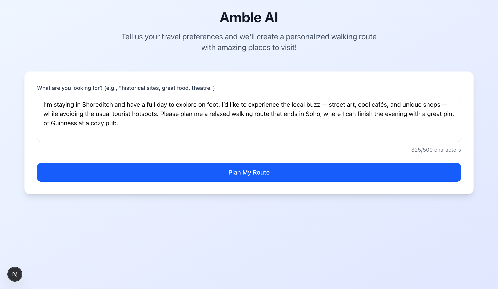
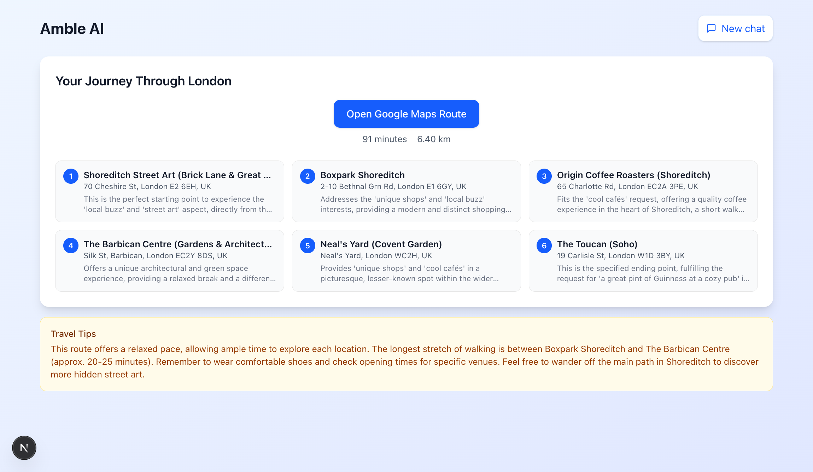
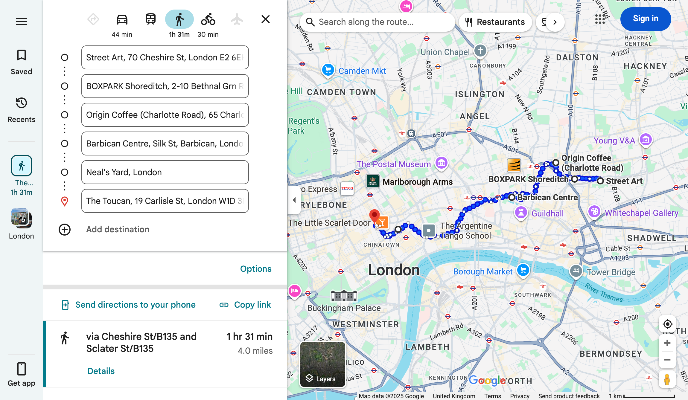

# Amble AI – Travel Route Planner

Generate verified, walkable city routes from natural language with a one‑click Google Maps experience.

## Overview

Amble AI turns plain‑English preferences (e.g., “make me a route which shows me all the best historical sites and local food in Lisbon”) into a curated, walkable route. It verifies real places via Google Places, orders stops intelligently, and produces a shareable Google Maps route link. The UI renders a compact, single‑page results view designed for fast scanning and zero scrolling.

## UI Preview

<p>
  
</p>
<p><em>Describe your ideal outing in natural language.</em></p>

<p>
  
</p>
<p><em>Compact results view: one‑click Google Maps route, time/distance summary, and a grid of stops which are clickable.</em></p>

<p>
  
</p>
<p><em>Open the complete route in Google Maps with all stops pre‑loaded.</em></p>

## Key Features

- Natural language to route: turn user intents into walkable routes
- Verified places: Google Places Text Search used to validate real locations
- Intelligent ordering: optional waypoint optimisation via Google Routes API
- One‑click navigation: open a complete Google Maps route with waypoints
- Compact UI: results fit on one page; zero scrolling post‑submit
- Resilient parsing: guards against truncated/markdown‑wrapped AI output
- Photo proxy: fetches place images via a server route using Places Photos API
- URL safety: auto‑encodes inputs and falls back if URL length limits are hit

## Tech Stack

- Framework: Next.js (App Router), React
- Language: TypeScript/JavaScript
- UI: Tailwind utility classes, Lucide Icons
- AI: Google Generative AI SDK (Gemini)
- Maps Platform: Google Places (Text Search, Photos), Google Routes (computeRoutes)

## Setup

Configure environment variables only.

1. Create a local env file

```bash
cp env.example .env.local
```

2. Add your keys to `.env.local`

```bash
GEMINI_API_KEY=your_gemini_api_key
GOOGLE_MAPS_API_KEY=your_google_maps_platform_key
```

Notes:

- Next.js automatically loads `.env.local` for local development.
- Do not commit secrets. Ensure `.env*` files are ignored by Git.
- Google Maps Platform usage may incur costs. Set sensible quotas for your project.

## Challenges & Learnings

- Robust AI JSON handling: Gemini sometimes returns fenced code blocks or truncated JSON. I added cleaning/validation logic (code‑fence stripping, required‑field checks, truncation detection) before parsing.
- Spatial limitations in LLMs: Gemini (and LLMs in general) are not very strong spatially and would sometimes hallucinate coordinates. I solved this by ignoring model‑provided coordinates, verifying places with Google Places Text Search, and selecting the best match using a confidence score (name similarity, city/address presence, business status, and ratings).

## Roadmap

- Multi‑day itineraries and time‑window constraints
- Additional modes (transit, cycling) and mixed‑mode support

## Getting Involved

Issues and suggestions are welcome. If you fork this project, please set your own API quotas and review Google Maps Platform attribution guidelines.
